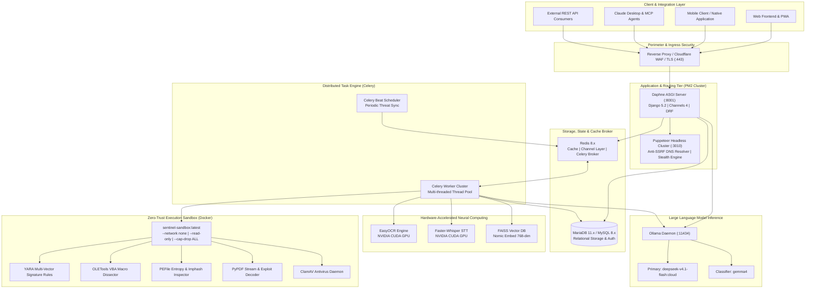
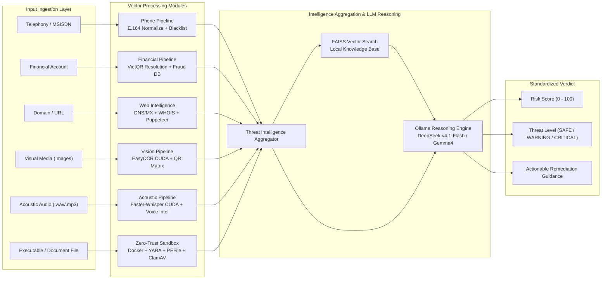
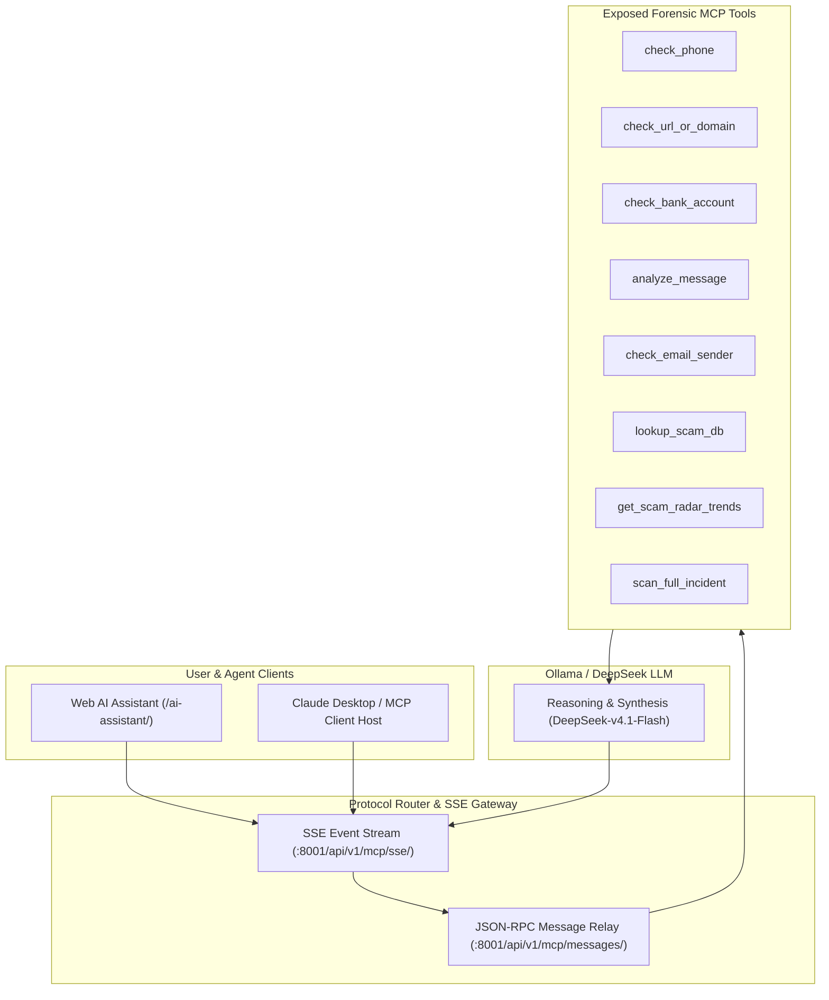

<div align="center">
  <h1>ShieldCall VN (Sentinel Core)</h1>
  <p><b>Advanced Multi-Modal Threat Intelligence, Zero-Trust Sandbox & Anti-Fraud Architecture</b></p>
  <p><b>Production Architecture:</b> <code>https://&lt;your-domain&gt;</code> | <b>Live Demo:</b> <a href="https://sc.fptoj.com">https://sc.fptoj.com</a></p>

  [](https://www.python.org/)
  [](https://www.djangoproject.com/)
  [](https://mariadb.org/)
  [](https://redis.io/)
  [-purple.svg)](https://ollama.com/)
  [](https://www.docker.com/)
  [](https://developer.nvidia.com/cuda-zone)
  [](https://pm2.keymetrics.io/)
</div>

---

## 1. Executive Summary & Architecture

**ShieldCall VN** is an enterprise-grade digital safety and cyber-fraud mitigation platform designed to detect, analyze, and neutralize multifaceted threats across telecommunication, financial, digital communication, and executable file vectors.

The platform employs a hybrid asynchronous architecture combining real-time ASGI WebSocket/SSE streams, background distributed task workers, GPU-accelerated neural computing, and an isolated Zero-Trust Docker Sandbox backed by industry-standard forensic toolsets.

### 1.1 System Architecture Topology



---

## 2. Multi-Vector Threat Analysis Pipeline

The platform evaluates artifacts across six dedicated investigation vectors, aggregates findings into structured telemetry, and executes heuristic and neural risk classification:



### 2.1 Vector Analysis Capabilities
- **Telecommunication & Number Scoring**: Normalizes international and domestic Vietnamese MSISDN formats, cross-referencing threat telemetry, carrier assignments, and community scam reports.
- **Financial Account Verification**: Performs programmatic lookup and beneficiary name resolution via VietQR integration, cross-referencing fraud intelligence databases.
- **Domain & Web Intelligence**: Inspects DNS MX records, domain age (WHOIS), SSL reputation, and ScamAdviser / Trustpilot metrics via SSRF-isolated relays.
- **Email & Messaging Forensics**: Dissects `.eml` and text messages, validating SPF, DKIM, and DMARC DNS alignment to identify spoofed corporate or government origins.
- **Multi-Modal AI Analysis**:
  - **Audio Streams**: Acoustic transcription via `Faster-Whisper` running on NVIDIA CUDA followed by psychological manipulation and urgency indicator extraction.
  - **Visual Media**: Image OCR via `EasyOCR` (GPU accelerated) combined with QR code matrix decoding and phishing banner classification.
- **Malware & APK Sandbox**: Dissects Windows binaries and Android APK packages in isolated Docker environments using YARA rules, PEFile, and ClamAV.
- **Social Engineering & Crypto Forensics**: Tracks Telegram channels, Zalo groups, fake VNeID portals, and suspicious crypto wallet addresses.

### 2.2 Zero-Trust Local Malware Sandbox Engine
Replaces third-party external dependencies with an entirely isolated on-premise containment engine:
- **Containment Model**: Every suspicious file is mounted read-only inside an ephemeral container (`sentinel-sandbox:latest`) with strict enforcement:
  - `--network none`: Complete network isolation. Zero external telemetry or outbound egress.
  - `--read-only`: Read-only root filesystem prevents modification or persistent writes.
  - `--cap-drop ALL`: Drops all Linux kernel capabilities.
  - `--security-opt=no-new-privileges:true`: Prevents privilege escalation.
  - `--memory 1g --cpus 2.0 --pids-limit 64`: Throttles resource abuse and prevents fork bombs.
- **Multi-Engine Static & Heuristic Dissection**:
  - **YARA Engine**: Scans binary patterns for ransomware extortion notes, process injection calls, and obfuscated droppers.
  - **OLETools (`olevba`)**: Dissects VBA macro streams in `.doc`, `.docx`, `.xls`, `.xlsx`, `.xlsm` files to detect `Auto_Open`, `Shell()`, and `WScript.Shell`.
  - **PEFile Engine**: Computes `imphash`, analyzes section Shannon entropy, and flags critical injection APIs (`VirtualAllocEx`, `WriteProcessMemory`, `CreateRemoteThread`).
  - **PyPDF Dissection**: Flags `/Launch` system execution commands, `/EmbeddedFiles` droppers, and `/JS` JavaScript streams.
  - **ClamAV Engine**: Cross-references against updated open-source antivirus definitions.

### 2.3 Hardened Puppeteer Headless Web Cluster
- **Anti-SSRF Isolation**: Validates all target hostnames and DNS resolutions to block access to private subnets (`10.0.0.0/8`, `172.16.0.0/12`, `192.168.0.0/16`, `127.0.0.0/8`, `169.254.169.254`).
- **Anti-Detection Stealth**: Employs `puppeteer-extra-plugin-stealth` with automated flag masking (`navigator.webdriver` removal, custom humanized User-Agents).
- **Leak Prevention & Resource Optimization**: Utilizes `WeakMap` page tracking, blocks heavy media streams (`audio`, `video`, `fonts`), and automatically recycles browser instances after 50 renders to release accumulated V8 memory.

### 2.4 Model Context Protocol (MCP) Remote Server
Exposes Sentinel threat tools directly to external AI agents, Claude Desktop, and IDE plugins over the standardized Model Context Protocol:



- **Discovery Endpoint**: `GET /api/v1/mcp/`
- **SSE Transport Stream**: `GET /api/v1/mcp/sse/`
- **JSON-RPC Message Relay**: `POST /api/v1/mcp/messages/`
- **Exposed Tools (10)**: `check_phone`, `check_bank_account`, `check_url_or_domain`, `analyze_message`, `check_email_sender`, `get_supported_banks`, `lookup_scam_db`, `get_scam_radar_trends`, `scan_full_incident`, `report_scam`.
- **System Prompts (3)**: `shieldcall_sentry`, `emergency_advisor`, `scam_investigator`.

---

## 3. Technology Stack

| Layer | Technologies |
| :--- | :--- |
| **Runtime Environment** | Python 3.11 (Virtualenv), Node.js v24.x, Docker Engine v29.x |
| **Web & API Framework** | Django 5.2.x, Django REST Framework, Daphne ASGI, Channels 4.x |
| **Database & Caching** | MariaDB 11.x / MySQL 8.x (`PyMySQL`), Redis 8.x (`django-redis`, `channels-redis`) |
| **Distributed Tasks** | Celery 5.6.x (Thread Pool Worker + Periodic Beat Scheduler) |
| **Hardware Acceleration** | NVIDIA CUDA GPU (Compute Capability 7.5+), cuDNN |
| **Malware Sandbox** | Docker Isolated Ephemeral Containers, YARA, OLETools, PEFile, PyPDF, ClamAV |
| **Browser Cluster** | Puppeteer Extra, Chromium (Headless), Stealth Plugin, Anti-SSRF Relay |
| **AI & Neural Computing** | Ollama SDK, PyTorch 2.x CUDA, FAISS (`nomic-embed-text-v1`), Faster-Whisper, EasyOCR |
| **Process Manager** | PM2 (Production Ecosystem with Dynamic Path Resolution) |
| **Security & Auth** | Cloudflare Turnstile, Django-OTP (TOTP/Email MFA), Google OAuth2, WhiteNoise |

---

## 4. API Specification Overview

Base URL: `/api/v1` (Production: `https://<your-domain>/api/v1`)

| Endpoint | Method | Purpose | Authentication |
| :--- | :--- | :--- | :--- |
| `/scan/phone/` | `POST` | Comprehensive telephone threat assessment | Turnstile / Token |
| `/scan/message/` | `POST` | SMS and social messaging fraud analysis | Turnstile / Token |
| `/scan/domain/` | `POST` | URL, domain reputation, and DNS/WHOIS scan | Turnstile / Token |
| `/scan/account/` | `POST` | Bank account fraud verification | Turnstile / Token |
| `/scan/banks/` | `GET` | National VietQR bank list and metadata retrieval | Public |
| `/scan/email/` | `POST` | Email phishing and header forensics (SPF, DKIM, DMARC) | Turnstile / Token |
| `/scan/image/` | `POST` | OCR extraction and visual fraud detection | Turnstile / Token |
| `/scan/audio/` | `POST` | Speech-to-text and voice phishing detection | Turnstile / Token |
| `/scan/file/` | `POST` | Zero-Trust Docker sandbox file analysis | Turnstile / Token |
| `/scan/lookup/` | `GET` | Multi-vector threat intelligence search across reports | Public |
| `/scan/status/<scan_id>/` | `GET` | Asynchronous scan status and result retrieval | Session / Auth |
| `/scan/<scan_id>/report-admin/` | `POST` | Request administrator verification for scan verdict | Authenticated |
| `/scan/analyze/stream/` | `POST` | Server-Sent Events (SSE) stream for scan events | Public / Token |
| `/chat/stream/` | `POST` | Server-Sent Events (SSE) AI assistant stream | Session / Token |
| `/chat/sessions/` | `GET`, `POST` | Manage chat conversation history sessions | Session / Token |
| `/mcp/` | `GET` | Model Context Protocol discovery metadata | Public |
| `/mcp/sse/` | `GET` | MCP Server-Sent Events endpoint for agents | Public |
| `/mcp/messages/` | `POST` | MCP JSON-RPC message relay | Public |
| `/report/` | `POST` | Submit community cybercrime or scam incident report | Public / Auth |
| `/report/<id>/` | `GET` | Retrieve verified scam incident details | Public / Auth |
| `/trends/daily/` | `GET` | Daily threat trend telemetry and regional metrics | Public |
| `/trends/hot/` | `GET` | Emerging viral scam tactics and attack waves | Public |
| `/trends/radar-stats/` | `GET` | Aggregated Scam Radar multi-vector statistics | Public |
| `/push/public-key/` | `GET` | Retrieve VAPID public key for WebPush client | Public |
| `/push/subscribe/` | `POST` | Register browser push subscription endpoint | Authenticated |
| `/scam-iq/start/` | `POST` | Initialize dynamic Scam IQ examination session | Authenticated |
| `/scam-iq/submit/` | `POST` | Submit Scam IQ exam responses for AI evaluation | Authenticated |
| `/scam-iq/history/` | `GET` | Retrieve historical examination score records | Authenticated |
| `/user/scans/` | `GET` | Historical scan telemetry for user account | Authenticated |
| `/user/api-keys/` | `GET`, `POST` | Provision and manage developer API keys | Authenticated |
| `/auth/register/` | `POST` | User registration with OTP validation | Public |
| `/auth/login/` | `POST` | Credential validation and MFA challenge trigger | Public |
| `/auth/mfa/verify/` | `POST` | Multi-Factor Authentication verification | Pre-auth Token |
| `/auth/me/` | `GET` | Retrieve current authenticated user profile | Authenticated |

Interactive OpenAPI and Swagger documentation:
- **Swagger UI**: `/api/docs/` (or `https://<your-domain>/api/docs/`)
- **ReDoc**: `/api/redoc/` (or `https://<your-domain>/api/redoc/`)
- **OpenAPI Schema**: `/api/schema/` (or `https://<your-domain>/api/schema/`)

---

## 5. Complete Setup & Deployment Guide

### 5.1 System Prerequisites
```bash
# Ubuntu / Debian
sudo apt-get update && sudo apt-get install -y \
  python3.11 python3.11-venv python3-pip \
  mariadb-server redis-server clamav clamav-daemon \
  docker.io docker-compose-v2 \
  chromium-browser chromium-chromedriver \
  nodejs npm ffmpeg git

# Start core services
sudo systemctl enable --now mariadb redis-server docker clamav-daemon
sudo chmod 666 /var/run/docker.sock
```

### 5.2 Environment Configuration (`.env`)
Create `.env` at the project root:

```bash
# Core
DEBUG=False
SECRET_KEY='<cryptographically_secure_token>'
ALLOWED_HOSTS=<your-domain>,localhost,127.0.0.1
SITE_URL=https://<your-domain>

# Database (MariaDB / MySQL)
DB_ENGINE=mysql
DB_NAME=shieldcall_db
DB_USER=shieldcall_user
DB_PASSWORD=<db_password>
DB_HOST=127.0.0.1
DB_PORT=3306

# Redis & Broker
REDIS_URL=redis://127.0.0.1:6379/0
REDIS_CACHE_URL=redis://127.0.0.1:6379/1

# AI & LLM Inference
OLLAMA_BASE_URL=http://localhost:11434
LLM_MODEL=deepseek-v4.1-flash:cloud
SMALL_MODEL=gemma4:31b-cloud

# GPU Acceleration
EASYOCR_GPU=True
WHISPER_DEVICE=cuda
WHISPER_MODEL_SIZE=small
VECTOR_DB_USE_GPU=True

# Anti-Bot & Auth
TURNSTILE_SITEKEY=<cloudflare_turnstile_sitekey>
TURNSTILE_SECRET=<cloudflare_turnstile_secret>
SOCIAL_AUTH_GOOGLE_OAUTH2_KEY=<google_oauth2_client_id>
SOCIAL_AUTH_GOOGLE_OAUTH2_SECRET=<google_oauth2_secret>

# Mail Delivery (SMTP)
EMAIL_BACKEND=django.core.mail.backends.smtp.EmailBackend
EMAIL_HOST=smtp.<your-domain>.com
EMAIL_PORT=587
EMAIL_USE_TLS=True
EMAIL_HOST_USER=noreply@<your-domain>.com
EMAIL_HOST_PASSWORD=<smtp_password>
DEFAULT_FROM_EMAIL=ShieldCall VN Support <noreply@<your-domain>.com>
```

### 5.3 Build the Docker Malware Sandbox Image
```bash
docker build -t sentinel-sandbox:latest ./sandbox
```

### 5.4 Install Dependencies & Build Assets
```bash
# Python Virtual Environment
python3.11 -m venv .venv
source .venv/bin/activate
pip install -r requirements.txt

# Database Migrations & Static Files
python manage.py migrate
python manage.py collectstatic --noinput

# Build Tailwind CSS Assets
npm --prefix theme/static_src install
npm --prefix theme/static_src run build

# Install Puppeteer Node Dependencies
cd scripts/puppeteer_host && npm install && cd ../..
```

### 5.5 Process Management via PM2
The system is managed via [ecosystem.config.js](./ecosystem.config.js):

```bash
# Start all microservices
pm2 start ecosystem.config.js

# Persist process configuration across reboots
pm2 save

# Inspect cluster health
pm2 status
pm2 logs --lines 50
```

Managed cluster processes (configurable via `.env` or system environment variables):
- `pkv-web`: ASGI server handling HTTP requests and WebSocket/SSE streams (binds to `${WEB_HOST}:${WEB_PORT}`, defaults to `0.0.0.0:8001`).
- `pkv-celery`: Multi-threaded Celery worker handling CUDA OCR, speech transcription, and sandbox jobs (concurrency configured via `CELERY_CONCURRENCY`).
- `pkv-celery-beat`: Periodic task scheduler.
- `pkv-puppeteer`: Headless Chromium render cluster with SSRF protection (binds to `PUPPETEER_HOST_PORT`, defaults to port `3010`).

---

## 6. Verification & Test Suites

Execute test suites to validate database integrity, LLM reasoning, sandbox analysis, and API endpoints:

```bash
# 1. Validate Ollama Integration & Model Readiness
.venv/bin/python scripts/test_ollama.py

# 2. Execute Backend API Integration Suite
.venv/bin/python scripts/test_api.py

# 3. Execute Django Unit Tests
.venv/bin/python manage.py test api.ai_chat.tests
```

---

## 7. License & Authorship

Developed by **Sentinel Team**. Proprietary and Confidential. Distributed under standard project terms.
